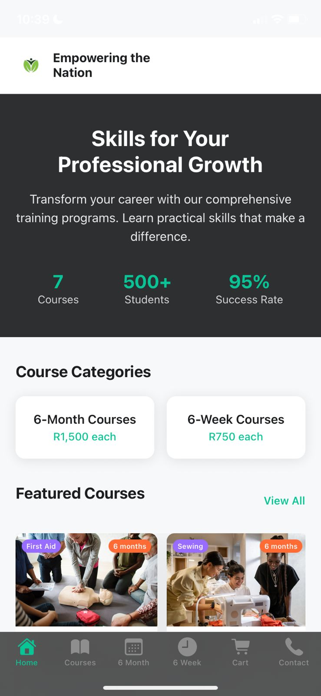
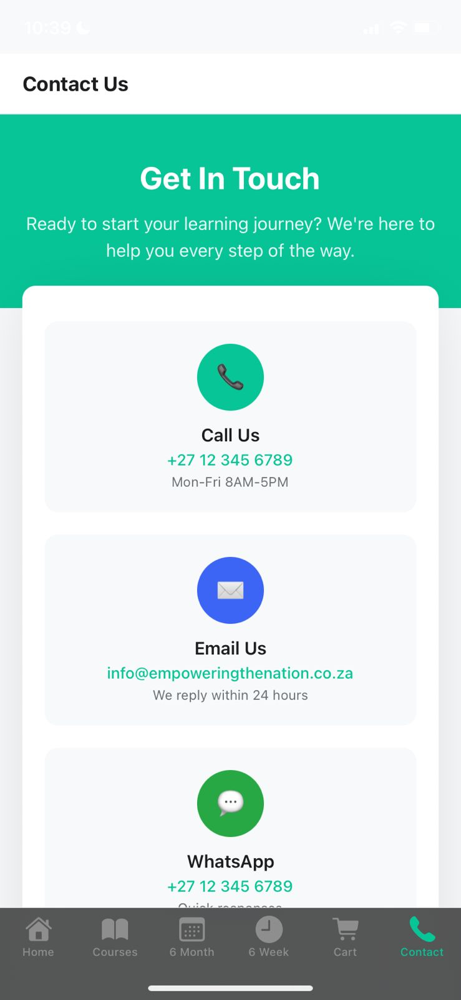

<div align="center">
  
  
  # 🚀 Empowering the Nation
  
  <p align="center">
    <strong>A modern React Native mobile application that provides access to educational courses and training programs</strong>
  </p>
  
  <p align="center">
    
    
    
    
  </p>
  
  <p align="center">
    <a href="#-features">Features</a> •
    <a href="#-getting-started">Getting Started</a> •
    <a href="#-screenshots">Screenshots</a> •
    <a href="#-contributing">Contributing</a>
  </p>
</div>

---

## 📋 Table of Contents

- [🎯 About](#-about)
- [✨ Features](#-features)
- [🛠️ Tech Stack](#️-tech-stack)
- [🚀 Getting Started](#-getting-started)
- [📱 Screenshots](#-screenshots)
- [🏗️ Project Structure](#️-project-structure)
- [👥 Contributors](#-contributors)
- [📄 License](#-license)

## 🎯 About

**Empowering the Nation** is a comprehensive educational mobile application built with React Native and Expo. The app serves as a platform for users to access various educational courses and training programs, featuring a modern interface with shopping cart functionality and cross-platform compatibility.

### Key Highlights

- 📚 **Diverse Course Catalog**: Access to both 6-week and 6-month training programs
- 🛒 **Shopping Cart**: Seamless course enrollment and management
- 📱 **Cross-Platform**: Native support for iOS, Android, and Web
- 🎨 **Modern UI/UX**: Clean, intuitive interface design
- ⚡ **Fast Performance**: Optimized with React Native and Expo

## ✨ Features

### 🎓 Educational Content
- **Course Catalog**: Browse through various educational programs
- **Program Types**: 
  - 📅 6-Week Intensive Courses
  - 📚 6-Month Comprehensive Programs
- **Course Categories**: Including but not limited to:
  - 👶 Baby Care
  - 👨‍🍳 Cooking
  - 🩹 First Aid
  - 🌱 Garden Maintenance
  - ✂️ Garment Tailoring
  - 🌿 Landscaping
  - 🎯 Life Skills

### 🛒 Shopping Experience
- **Cart Management**: Add and remove courses from your cart
- **Easy Checkout**: Streamlined enrollment process
- **Course Tracking**: Monitor your enrolled programs

### 📞 Contact & Support
- **Contact Information**: Easy access to support channels
- **Help Resources**: Quick access to assistance

## 🛠️ Tech Stack

| Category | Technology |
|----------|------------|
| **Framework** | React Native with Expo |
| **Language** | TypeScript |
| **Navigation** | Expo Router with Tab Navigation |
| **UI Components** | React Native Components |
| **Styling** | Custom CSS-in-JS with React Native StyleSheet |
| **State Management** | React Context API |
| **Development** | Expo CLI, ESLint |

## 🚀 Getting Started

### Prerequisites

Before you begin, ensure you have the following installed:

- **Node.js** (v16 or higher) - [Download here](https://nodejs.org/)
- **npm** or **yarn** - Package managers
- **Expo CLI** - Install globally with `npm install -g @expo/cli`
- **iOS Simulator** (for iOS development) - Requires Xcode on macOS
- **Android Studio/Emulator** (for Android development) - [Download here](https://developer.android.com/studio)

### Installation

1. **Clone the repository**
   ```bash
   git clone https://github.com/Dragonz-XHAW/Moblie-App
   cd Moblie-App
   ```

2. **Install dependencies**
   ```bash
   npm install
   # or
   yarn install
   ```

3. **Start the development server**
   ```bash
   npm start
   # or
   yarn start
   ```

4. **Run on your preferred platform**
   ```bash
   # For iOS
   npm run ios
   
   # For Android
   npm run android
   
   # For Web
   npm run web
   ```

### Development

The application uses Expo Router for navigation with a tab-based structure:

- **Home Tab**: Main landing page
- **Courses Tab**: Browse available courses
- **Cart Tab**: Manage your course selections
- **Contact Tab**: Get in touch with support

## 📱 Screenshots

<div align="center">
  <table>
    <tr>
      <td align="center">
        <strong>🏠 Home Screen</strong><br/>
        
        <p>Welcome screen with app overview and navigation</p>
      </td>
      <td align="center">
        <strong>📚 Courses Page</strong><br/>
        
        <p>Browse and explore available educational programs</p>
      </td>
      <td align="center">
        <strong>📞 Contact Page</strong><br/>
        
        <p>Get in touch with our support team</p>
      </td>
    </tr>
  </table>
</div>

## 🏗️ Project Structure

```
Moblie-App/
├── 📁 app/                    # Expo Router app directory
│   ├── 📁 (tabs)/            # Tab navigation screens
│   ├── _layout.tsx           # Root layout
│   └── +not-found.tsx        # 404 page
├── 📁 assets/                # Static assets
│   ├── 📁 images/           # Images and logos
│   └── 📁 fonts/            # Custom fonts
├── 📁 src/                   # Source code
│   ├── 📁 components/       # Reusable components
│   ├── 📁 constants/        # App constants and data
│   ├── 📁 contexts/         # React contexts
│   ├── 📁 hooks/            # Custom hooks
│   ├── 📁 screens/          # Screen components
│   └── 📁 styles/           # Style definitions
├── 📁 readme/               # Documentation assets
└── 📄 README.md             # Project documentation
```

## 👥 Contributors

This project was developed by the **Dragonz Team**:

<table>
  <tr>
    <td align="center">
      <strong>👨‍💻 Mazen Ba Hamid</strong><br/>
      <sub>ST10486439</sub><br/>
      <em>PM, Lead Developer</em>
    </td>
    <td align="center">
      <strong>👨‍💻 Zia Abdull</strong><br/>
      <sub>ST10486244</sub><br/>
      <em>Co-Developer</em>
    </td>
    <td align="center">
      <strong>👨‍💻 Osama Al Batati</strong><br/>
      <sub>ST10477069</sub><br/>
      <em>Quality Assurance, SEO</em>
    </td>
  </tr>
</table>

## 🤝 Contributing

We welcome contributions to improve **Empowering the Nation**! Here's how you can help:

1. **Fork the repository**
2. **Create a feature branch** (`git checkout -b feature/AmazingFeature`)
3. **Commit your changes** (`git commit -m 'Add some AmazingFeature'`)
4. **Push to the branch** (`git push origin feature/AmazingFeature`)
5. **Open a Pull Request**

### Development Guidelines

- Follow the existing code style and conventions
- Write meaningful commit messages
- Test your changes on multiple platforms
- Update documentation when necessary

## 📄 License

This project is licensed under the MIT License - see the [LICENSE](LICENSE) file for details.

---

<div align="center">
  <p><strong>Built with ❤️ by the Dragonz Team</strong></p>
  <p>
    <a href="#top">⬆️ Back to Top</a>
  </p>
</div>